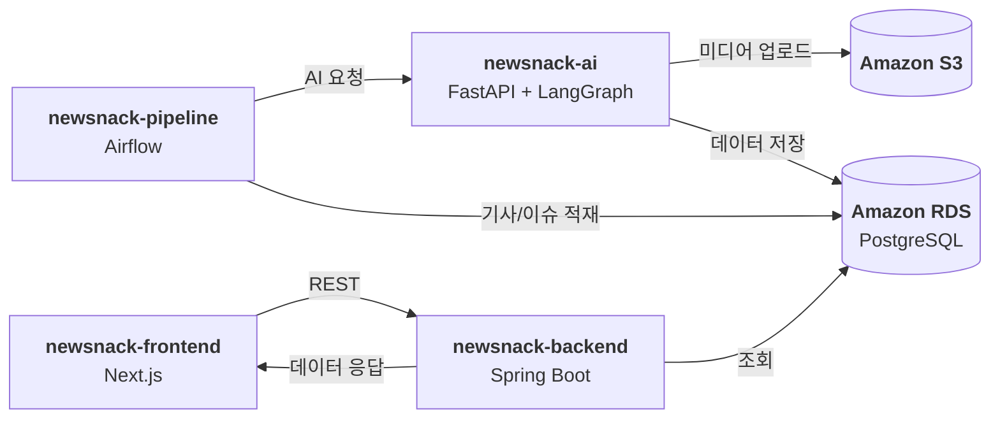

# 뉴스낵 Backend

뉴스낵 서비스의 메인 API 서버입니다. 프론트엔드 요청을 처리하고 AI/데이터 파이프라인이 적재한 결과를 조회·가공해 제공하며, 감정 반응을 집계합니다.

## 전체 구조

- **newsnack-pipeline**: Airflow 기반 뉴스 수집, 이슈 집계, AI 생성 요청 오케스트레이션
- **newsnack-ai**: FastAPI + LangGraph 기반 워크플로로 AI 기사/오늘의 뉴스낵 생성, Gemini/OpenAI 호출 및 저장
- **newsnack-backend**: 프론트엔드 공개 API, 조회/큐레이션/반응 처리



## 주요 기능

- 오늘의 뉴스낵 조회
- 분야별/감정별 큐레이션
- 무한 스크롤 피드 조회
- 콘텐츠 상세 조회 (요약/본문/이미지/출처)
- 감정 반응 집계
- 에디터 프로필 및 최근 콘텐츠 조회

## 기술 스택

[![Kotlin]][Kotlin url]
[![Spring Boot]][Spring Boot url]
[![Spring Data JPA]][Spring Data JPA url]
[![QueryDSL]][QueryDSL url]
[![PostgreSQL]][PostgreSQL url]
[![Swagger]][Swagger url]
[![AWS EC2]][AWS EC2 url]
[![AWS S3]][AWS S3 url]
[![AWS RDS]][AWS RDS url]

## API 요약

### 오늘의 뉴스낵
- `GET /today-newsnack`

### 콘텐츠
- `GET /contents` (cursor/size/categoryId)
- `GET /contents/{id}`
- `GET /contents/curations/category-best`
- `GET /contents/curations/emotion-best`
- `POST /contents/{id}/reactions`

### 에디터
- `GET /editors/{id}`

Swagger UI: `/swagger-ui/index.html`

## 로컬 실행

### 1) 환경 변수

`.env` 또는 OS 환경 변수로 설정합니다.

```bash
DB_URL=jdbc:postgresql://localhost:5432/newsnack
DB_USERNAME=your_username
DB_PASSWORD=your_password
```

### 2) 실행

```bash
./gradlew bootRun
```

## 운영 환경 참고

- 기본 타임존은 UTC입니다.
- CORS 허용 도메인은 `cors.allowed-origins`로 설정합니다.

<!-- MARKDOWN LINKS & IMAGES -->
[Kotlin]: https://img.shields.io/badge/Kotlin-7F52FF?style=for-the-badge&logo=kotlin&logoColor=white
[Kotlin url]: https://kotlinlang.org/
[Spring Boot]: https://img.shields.io/badge/Spring%20Boot-6DB33F?style=for-the-badge&logo=springboot&logoColor=white
[Spring Boot url]: https://spring.io/projects/spring-boot
[Spring Data JPA]: https://img.shields.io/badge/Spring%20Data%20JPA-6DB33F?style=for-the-badge&logo=spring&logoColor=white
[Spring Data JPA url]: https://spring.io/projects/spring-data-jpa
[QueryDSL]: https://img.shields.io/badge/QueryDSL-2C3E50?style=for-the-badge&logo=databricks&logoColor=white
[QueryDSL url]: http://querydsl.com/
[PostgreSQL]: https://img.shields.io/badge/PostgreSQL-336791?style=for-the-badge&logo=postgresql&logoColor=white
[PostgreSQL url]: https://www.postgresql.org/
[Swagger]: https://img.shields.io/badge/Swagger-85EA2D?style=for-the-badge&logo=swagger&logoColor=black
[Swagger url]: https://swagger.io/
[AWS EC2]: https://img.shields.io/badge/AWS%20EC2-FF9900?style=for-the-badge&logo=amazon-ec2&logoColor=white
[AWS EC2 url]: https://aws.amazon.com/ec2/
[AWS S3]: https://img.shields.io/badge/AWS%20S3-FF9900?style=for-the-badge&logo=amazon-s3&logoColor=white
[AWS S3 url]: https://aws.amazon.com/s3/
[AWS RDS]: https://img.shields.io/badge/AWS%20RDS-527FFF?style=for-the-badge&logo=amazon-rds&logoColor=white
[AWS RDS url]: https://aws.amazon.com/rds/
